# What Is Life 2 — Number 2 Mock-up Implementation Pseudocode

Status: screen implementation authority; mechanics remain subject to the
causal model in `FORM_AND_PLAY_MODEL.md`  
Date: 2026-08-02

## Purpose

This document accounts for every image in the Number 2 mock-up set. It says
what is a real screen, what is an art-direction plate, what the player actually
does, what state changes, what is merely observed, which current modules can
support it, and the pseudocode required to implement it.

It is deliberately stricter than the pictures. A beautiful control with no
defined target, unit, transition, or reading is omitted until a real system
exists.

## Global implementation rules

### One causal direction

```text
authoritative state
  + scheduled environmental input
  + explicit player control/intervention
  + runtime randomness
        |
        v
  causal transition
        |
        v
  immutable history
        |
        v
  passive View and instruments
```

Observation never alters the causal transition.

### Hot path and cold path

Retain the existing split.

```text
HOT, 30 steps/s
React input
  -> worker InputFrame
  -> Rust Run/Field transition
  -> compact frame snapshot
  -> worker decoder
  -> Pixi WebGL or Canvas2D

COLD, on demand
React laboratory request
  -> worker analysis command/job
  -> cloned Rust state or recorded history
  -> compact analysis result
  -> React instrument panel and optional render overlay
```

Do not stream complete Ensemble, Holdout, Archive, or lineage states in every
render frame.

### Target state boundaries

```rust
struct RunStateV2 {
    scenario: ScenarioSpec,
    causal: CausalWorld,
    trace: CausalTrace,
    progress: Progress,
    anchors: Vec<Checkpoint>,
    // No Observation View inside the step input.
}

struct CausalWorld {
    scenario_hash: Hash,
    embodied: EmbodiedState,
    supplies: Vec<SupplyStream>,
    disturbances: Vec<DisturbanceState>,
    rng: RngState,
}

struct ScenarioSpec {
    phi: PhysicalBackground,
    generator: GeneratorSpec,
    initial_state_distribution: InitialStateDistribution,
    exogenous_inputs: Vec<PhysicalInputSchedule>,
    control_contract: ControlContract,
    criterion: FunctionCriterion,
    intervention_plan: InterventionPlan,
    analysis_protocols: Vec<ViewDeclaration>,
}

struct GeneratorSpec {
    component_kinds: Vec<ComponentKindSpec>,
    topology_constraints: TopologySpec,
    local_policy: FrozenLocalPolicy,
    addressed_inputs: Vec<AddressedInputSpec>,
}

struct EmbodiedState {
    forms: Vec<FormState>,
    components: Vec<ComponentState>,
    routes: Vec<RouteState>,
    compartment: PhysicalCompartment,
    material: Vec<MaterialPool>,
    local_timers: Vec<LocalTimer>,
}

struct AnalysisWorkspace {
    active_view: ViewDeclaration,
    saved_views: Vec<ViewDeclaration>,
    selected_instrument: InstrumentKind,
    selected_trial: Option<TrialId>,
}
```

### Protocol additions

The protocol remains a closed set at version 2. The implemented additions are
top-level commands rather than ad-hoc optional fields.

```ts
type CommandNameV2 =
  | ExistingV1Commands
  | 'reopen_archive'
  | 'run_analysis'
  | 'sample_instrument'
  | 'inspect_field'
  | 'compile_scenario'
  | 'run_scenario'
  | 'sample_lens'
  | 'renewal_trial'
  | 'renewal_inventory'
```

`sample_instrument` reads the standing complete View and does not mutate the
causal world, spend Intervention Budget, or end a causal trace window.
`inspect_field` resolves a rendered local target into exact authoritative state
on demand. The dedicated analysis worker reports progress outside the core
event set while each job arm enters Rust through `run_analysis`.

### Render layers

Extend the existing `Scene`; do not replace the renderer.

```ts
interface Number2Scene {
  staticBackdrop: Layer
  mediumVisuals: Layer
  supplyStreams: Layer
  directedRoutes: Layer
  physicalCompartments: Layer
  components: Layer
  storedResourceBloom: Layer
  wakeCaches: Layer
  forms: Layer
  viewApertures: Layer
  instrumentOverlay: Layer
  interventionPreview: Layer
  divergenceTrace: Layer
  ensembleGhosts: Layer
  cues: Layer
  disturbanceFields: Layer
  chrome: Layer
}
```

Dense filaments, gel texture, and Atlas geography are cached textures. Live
objects and measurements remain interactive layers.

## Complete image inventory

| Reference image | Feature | Disposition |
|---|---|---|
| [open-field-refined.png](assets/number-2/open-field-refined.png) | Open Field, refined | Canonical screen |
| [archive.png](assets/number-2/archive.png) | Archive | Canonical concept |
| [autonomous-renewal.png](assets/number-2/autonomous-renewal.png) | Autonomous Renewal | Canonical concept after causal correction |
| [active-commissioning.png](assets/number-2/active-commissioning.png) | Active commissioning under Supply-path displacement | Canonical field composition |
| [intervention-bench.png](assets/number-2/intervention-bench.png) | Intervention Bench | Canonical layout after typed-tool correction |
| [ensemble-overlay.png](assets/number-2/ensemble-overlay.png) | Ensemble Overlay | Canonical analysis screen |
| [physical-compartment-and-view.png](assets/number-2/physical-compartment-and-view.png) | Physical compartment and passive View | Primary systems reference |
| [disturbance-grammar.png](assets/number-2/disturbance-grammar.png) | Disturbance grammar | Canonical art with literal names |
| [still-mode.png](assets/number-2/still-mode.png) | Still Mode queue | Canonical construction screen |
| [measurement-grain.png](assets/number-2/measurement-grain.png) | Measurement Grain | Canonical passive instrument |
| [open-field-equation-study.png](assets/number-2/open-field-equation-study.png) | Open Field, equation-heavy study | Superseded screen; retain layout ideas only |
| [holdout-validation.png](assets/number-2/holdout-validation.png) | Holdout Validation dashboard | Canonical layout |
| [holdout-atmosphere-study.png](assets/number-2/holdout-atmosphere-study.png) | Atmospheric Holdout study | Art plate, not a separate screen |
| [observe-bench.png](assets/number-2/observe-bench.png) | Observe Bench | Canonical layout after instrument correction |
| [crowded-medium.png](assets/number-2/crowded-medium.png) | Crowded Medium | Canonical environmental art direction |
| [atlas.png](assets/number-2/atlas.png) | Atlas | Canonical composition |
| [divergence-replay.png](assets/number-2/divergence-replay.png) | Divergence Replay | Canonical analysis composition |
| [atlas-texture.png](assets/number-2/atlas-texture.png) | Label-free three-region Field texture | Runtime asset reference, not a screen |
| [life-cycle.png](assets/number-2/life-cycle.png) | Batch Inheritance Assay | Canonical external-assay composition; not autonomous reproduction |
| [vestige-pressure-study.png](assets/number-2/vestige-pressure-study.png) | Vestige pressure study | Art plate, not a separate screen |
| [select-form.png](assets/number-2/select-form.png) | Select Form | Canonical selection composition |

---

## 1. Atlas

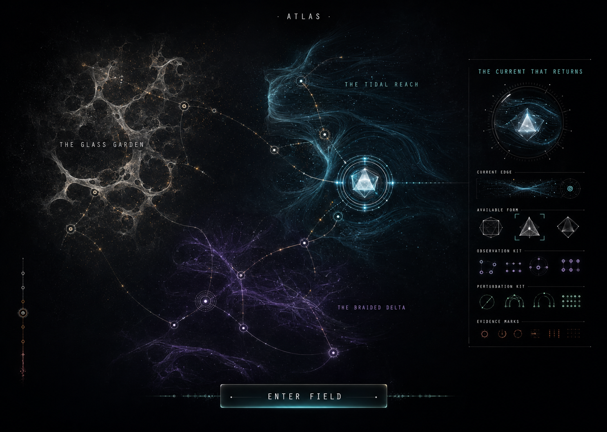

### Reality of play

The Atlas is a selectable catalogue of Field regimes. Each destination states
the real physical conditions under which a generator will be commissioned and
tested. Atmospheric location names may be secondary subtitles.

Selection is passive. Entering a destination initializes a causal run.

### Inputs and feedback

- Pointer click or Left/Right selects a destination.
- Enter opens an implemented destination.
- The detail card states medium behavior, Supply rate and schedule,
  dissipation, transport variability, physical-compartment material,
  interventions, and the function contract.
- Pending regimes remain visible but cannot start a disguised copy of another
  model.

### Implementation pseudocode

```ts
interface RegimeCatalogEntry {
  id: RegimeId
  technicalNameKey: CopyKey
  atmosphericSubtitleKey: CopyKey | null
  status: 'implemented' | 'pending'
  facts: Array<{ labelKey: CopyKey; value: number; unitKey: CopyKey }>
  artAnchor: { xPercent: number; yPercent: number }
  asset: string
}

function Atlas({ catalog, onOpen }) {
  const [selected, setSelected] = useRovingSelection(catalog)

  onPointerSelect(regimeId => setSelected(regimeId))
  onArrowKey(direction => moveSelection(direction))
  onEnter(() => {
    if (selected.status === 'implemented') onOpen(selected.id)
  })

  return renderStaticTextureWithDomInstruments(catalog, selected)
}

async function openRegime(regimeId) {
  openingDraft.regimeId = regimeId
  routeTo('form-select')
}
```

### Module map

- Existing shell: `app/src/shell/Atlas.tsx`.
- Existing asset: `app/public/assets/atlas-field-number-2.webp`.
- Add: `content/regimes/<id>.json` and generated shell-visible regime catalog.
- Extend: `init_run`/`open_regime` so Rust receives `regime_id`; current code
  always opens the first linear chapter.
- Keep Pixi stopped on the Atlas.

---

## 2. Label-free Atlas texture

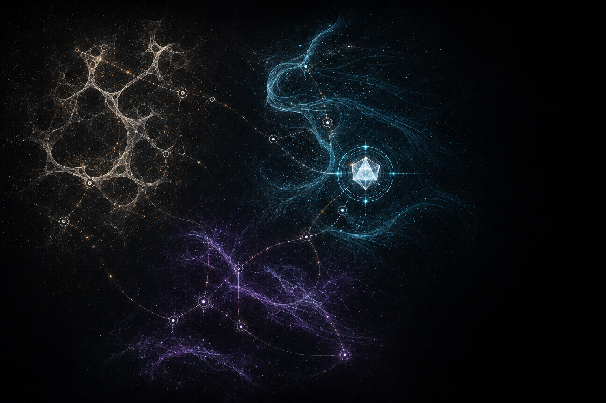

This is not a screen. It is a source plate for the cached Atlas background.

```text
source plate
  -> crop/color-correct once
  -> encode WebP/AVIF at build time
  -> render as one responsive background texture
  -> position live destination markers in a shared art coordinate system
```

Marker coordinates must be calculated against the fitted artwork bounds, not
raw viewport percentages, because `object-fit: cover` crops different edges at
different aspect ratios.

```ts
function artToScreen(point, viewport, sourceAspect) {
  fitted = containOrCoverRect(viewport, sourceAspect)
  return fitted.origin + point * fitted.size
}
```

---

## 3. Select Form

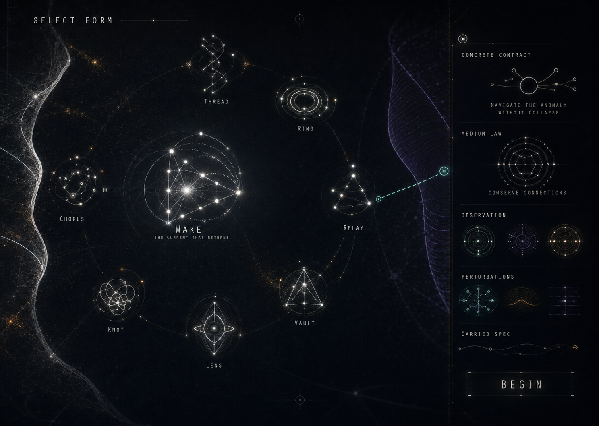

### Reality of play

The player chooses the bright object they will steer: a mobile commissioning
chassis and one Component of the final generator. It is not a character class
and not the complete generator.

The right panel shows exact, non-collapsed parameters and the selected Field's
predicted interaction with them.

### Required values

- steering response;
- operating limit in `CU`;
- upkeep in `CU/s`;
- global coupling-Pulse radius and effects;
- construction span in field units;
- capacity of new Routes in `CU/s`;
- chassis-local loss, only if implemented;
- actual ability and implementation status.

### Implementation pseudocode

```ts
interface FormCatalogEntry {
  id: FormId
  steerScale: Frac
  operatingLimitQ: Fx
  upkeepQPerStep: Fx
  constructionSpan: Fx
  routeCapacityQPerStep: Fx
  localPermeability: Frac | null
  ability: AbilityContract
  status: 'complete' | 'partial' | 'pending'
}

interface GlobalPulseContract {
  minRadius: Fx
  maxRadius: Fx
  transferFraction: Frac
  directEffects: PulseEffectKind[]
}

function FormSelect({ regimeId, catalog, onBegin }) {
  selected = useRovingSelection(catalog)
  comparison = compareFormToRegime(selected, regimeId)

  renderFormConstellation(catalog, selected)
  renderMeasuredContract(selected, comparison)

  onEnter(() => {
    if (selected.status !== 'pending') onBegin(regimeId, selected.id)
  })
}

async function beginRun(regimeId, formId) {
  await worker.send('open_regime', { regime_id: regimeId, form: formId })
  routeTo('field')
}
```

### Module map

- Replace the qualitative-only assumptions in
  `app/src/shell/FormSelect.tsx`.
- Generate catalog values from `content/forms/*.json`; do not duplicate
  machine numbers in React.
- Migrate global Form `leak_frac` to physical-compartment material data.
- Disable Lens, Vault, Knot, or Wake if their defining ability remains
  decorative.

---

## 4. Active commissioning and Supply-path displacement

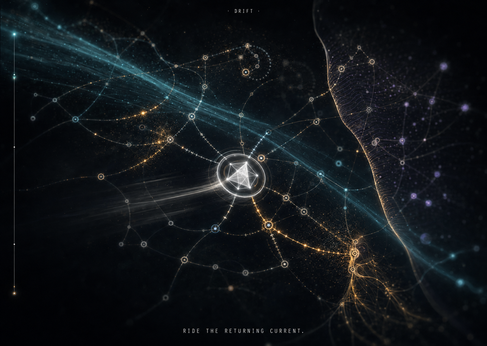

### Reality of play

This is the immediate game. The player steers the Form through a spatial Field,
keeps it within finite Supply regions, activates Components, commissions
Routes, and maintains a concrete function while the environment changes.

The depicted cyan stream currently supplies resource but does not push the
Form. The screen may not imply advection until `MediumVelocityField` exists.

### Controls

- WASD or Arrow keys: steering vector. Pointer motion never steers.
- Hold E: increase coupling radius.
- Release E: apply the coupling Pulse.
- Wheel or brackets: change layer.
- Space: enter Still Mode.
- Ability key: execute the selected Form's implemented ability.

Pointer input remains inspection-only during active play. While E is held, the
true radius is drawn in world space; affected objects receive target locks and
effect-direction animation before release. The compact shell instrument lists
only nonzero predicted outcomes. Port locks consume exact Node ids from the
core's cloned release projection; screen-space proximity is not an admissible
substitute. A dormant Route is visibly broken at every closed endpoint and an
operational Route carries a persistent tail-to-head notch even when its current
flow is zero.

The upper edge carries a compact campaign-position rail whenever authored
chapter content is active. `chapter_changed` supplies chapter and objective
counts and the frame supplies current objective ordinal and the continuous
campaign step. The rail shows chapter title, `Chapter N / total`, `Objective N
/ total`, elapsed campaign time, chapter progress, and overall progress. It is
not shown on the Atlas or Form selection surfaces.

### Implementation pseudocode

```ts
function useFieldControls(surface) {
  steering = resolveKeyboardVector()
  pulse = resolveHeldAndReleaseEdges()
  depth = resolveWheelOrBracketStep()
  ability = resolveAbilityEdge()

  worker.postInputFrame({
    steer_x: steering.x,
    steer_y: steering.y,
    pulse_held: pulse.held,
    pulse_release: pulse.released,
    depth_key: depth,
    ability,
  })
}
```

```rust
fn advance_commissioning_step(world, control) {
    apply_medium_force_if_implemented(world);
    steer_controlled_forms(world, control.steering);
    integrate_positions(world);
    mirror_form_component_positions(world);
    apply_form_ability(world, control.ability);
    apply_coupling_pulse(world, control.pulse);
    run_local_rules(world);
    transfer_routes_with_versioned_simultaneous_allocator(world);
    deliver_supplies(world);
    apply_physical_compartment_loss(world);
    pay_upkeep(world);
    record_ledgers_and_external_control(world, control);
}
```

The allocator snapshots all stocks, headroom, gates, and capacities; scales
competing requests proportionally at each source and destination; rounds every
accepted amount down; leaves residue or rejected transfer at its source; and
applies every transfer at the step boundary. A received amount cannot travel
again until the next step. Supply sharing and rejection use the same declared
rule. This law, update order, and latency are versioned with `Phi`.

### Concrete HUD

Show only the current contract's necessary values. Example:

```text
Route A->B: 23.4 / 20.0 CU/s
Lowest required Component: 18 CU
Physical leakage: 8.2% of Supply
Failure grace remaining: 1.4 s
```

### Module map

- Existing input: `app/src/shell/steering.ts`, `pulse.ts`, `FieldSurface.tsx`.
- Existing worker schedule: `worker/src/entry.ts`.
- Existing transition: `core/src/field.rs`.
- Existing render: `app/src/render/scene.ts` plus WebGL/Canvas engines.
- Add an ability edge to protocol v2 and sparse ability cues to frame v2.

---

## 5. Intervention Bench

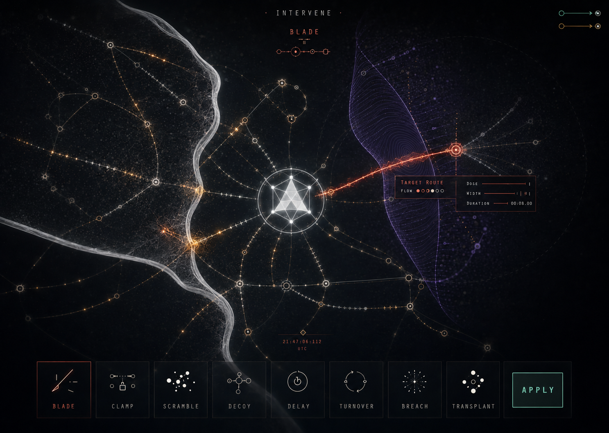

### Reality of play

The player selects one typed experiment, clicks a compatible target, adjusts
only physically meaningful parameters, pins an outcome reading, previews the
change, and applies it either to a cloned counterfactual or to the live causal
world when that mode is explicitly chosen.

The universal `target / dose / width / duration` panel in the picture is
retired.

### Typed schemas

```ts
type InterventionDraft =
  | { kind: 'remove_route'; routeId: RouteId; onsetStep: Step; scope: 'replay' | 'live' }
  | { kind: 'limit_route'; routeId: RouteId; ceilingQPerStep: Fx; durationSteps: number }
  | { kind: 'misroute'; routeIds: RouteId[]; probability: Frac; durationSteps: number; seed: Seed }
  | { kind: 'divert_supply'; supplyId: SupplyId; receiver: ComponentId; fraction: Frac; durationSteps: number }
  | { kind: 'delay_input'; inputId: InputId; delaySteps: number; onsetStep: Step }
  | { kind: 'external_substitution'; componentIds: ComponentId[]; transfer: TransferPolicy }
  | { kind: 'raise_leak_coefficient'; proposedMembers: ComponentId[]; deltaPerExternalContactPerStep: Frac; durationSteps: number }
  | { kind: 'transplant'; generatorId: GeneratorId; regimeId: RegimeId; retention: RetentionPolicy }
```

The current external-substitution `TransferPolicy` must disclose kind, layer and
position, open state, capacity, upkeep, Form association, analytical membership
replacement, and all incoming and outgoing Route endpoints. None is implied by
the single word “replace.”

### Implementation pseudocode

```ts
function InterventionBench() {
  tool = selectSupportedTool()
  target = pickCompatibleFieldObject(tool.targetKind)
  draft = editToolSpecificParameters(tool, target)

  preview = await worker.send('preview_intervention', {
    anchor_id: activeAnchor,
    intervention: draft,
    outcome: pinnedObservable,
  })

  renderTargetMark(preview.target)
  renderBeforeAfterReading(preview.outcome)

  onApply(() => worker.send('apply_intervention', {
    anchor_id: activeAnchor,
    intervention: draft,
  }))
}
```

### Honest current support

- Route removal: existing counterfactual replay.
- Boundary severance: existing replay, but currently reads the conflated View.
- External substitution: existing replay; auto-transferred topology must be
  disclosed.
- Delayed replay: existing replay.
- Full replacement: external substitution, not renewal.
- Capacity limit and raised boundary leakage now have paid, duration-bounded
  live core models. Misrouting, supply diversion as an experimental tool, and
  true transplant still require new core models.

Unsupported tools do not appear as interactive cards.

---

## 6. Observe Bench

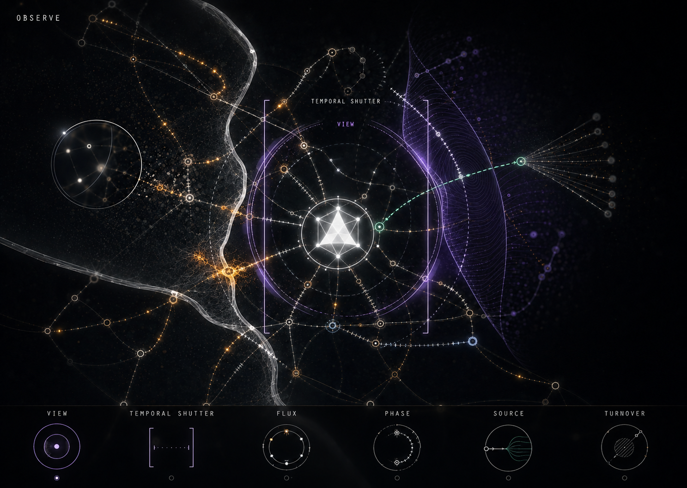

### Reality of play

The player moves a passive View aperture, selects a literal instrument, and
receives a reading tied to a target and a stated time window. Nothing in the
causal world changes.

### Correct instrument rail

```ts
type InstrumentKind =
  | 'route_flow'
  | 'view_boundary_flow'
  | 'supply_uptake'
  | 'physical_leakage'
  | 'response_lag'
  | 'initial_stock_estimate'
```

`response_lag` resolves only when a named periodic causal input exists and the
retained window carries enough samples. The implemented passive reading uses
the addressed Current's exact duty-cycle ceiling and selected stored-Charge
trace; absence of either returns an explicit unavailable provenance.
`initial_stock_estimate` is labelled as an estimate until tagged provenance is
implemented.

External-substitution tolerance is absent from this rail. It requires causal
interventions on cloned worlds and belongs to the Counterfactual/Intervention
Bench even though it leaves the live run unchanged.

### Implementation pseudocode

```ts
function ObserveBench({ history }) {
  view = usePassiveViewEditor()
  instrument = useInstrumentSelection()
  target = useInstrumentTarget(instrument)

  result = await worker.send('inspect_view', {
    view,
    instrument,
    target,
    trial_id: selectedTrial,
  })

  renderViewAperture(view)       // violet, thin, noncausal
  renderReading({
    value: result.value,
    unit: result.unit,
    windowSteps: view.window,
    target: result.target,
    provenance: result.provenance,
  })
}
```

### Core constraint

```rust
fn inspect_view(history: &History, request: ViewRequest) -> Reading
```

The function receives immutable history, not `&mut RunState`. The type boundary
should make causal mutation impossible.

---

## 7. Physical compartment and passive View

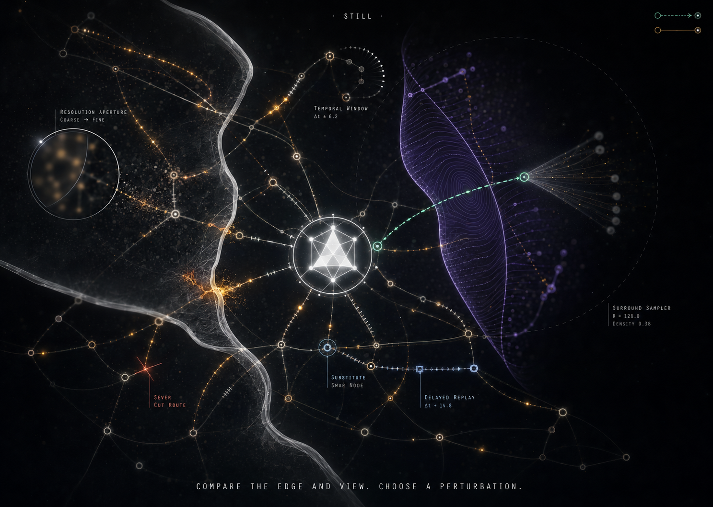

This picture becomes a combined Still/Observe surface with two explicit modes.

### Physical mode

- Thick grey material boundary.
- Drag handles propose a causal compartment edit.
- Panel shows member changes, permeability, predicted leakage, upkeep, and
  Intervention Budget cost.
- Commit is required.

### View mode

- Thin violet aperture.
- Dragging changes observed membership only.
- Controls set Measurement Grain, Analysis Window, and Comparison Neighborhood.
- Free, immediate, and noncausal.

### Core migration pseudocode

```rust
struct PhysicalCompartment {
    members: Vec<ComponentId>,
    leak_per_exposed_contact_per_step: Frac,
}

fn advance(world: &mut CausalWorld, control: ControlState) {
    let members = &world.embodied.compartment.members;
    apply_physical_leakage(world, members);
    // No View parameter exists here.
}
```

```ts
type CausalPlanCommand =
  | ExistingRouteCommand
  | { op: 'set_compartment_members'; members: ComponentId[] }
  | { op: 'set_leak_coefficient'; valuePerExternalContactPerStep: Frac }

type PassiveAnalysisEdit = {
  view: ViewDeclaration
}
```

### Save/frame migration

```text
save v1:
  initialize physical_compartment.members from old view.inside once
  copy old View into analysis metadata
  mark imported traces non-proof-grade if a historical View edit changed leakage

frame v2:
  separate edge_member bit
  derive thick rendered geometry from authoritative membership
  separate view overlay supplied by shell
```

---

## 8. Still Mode queue

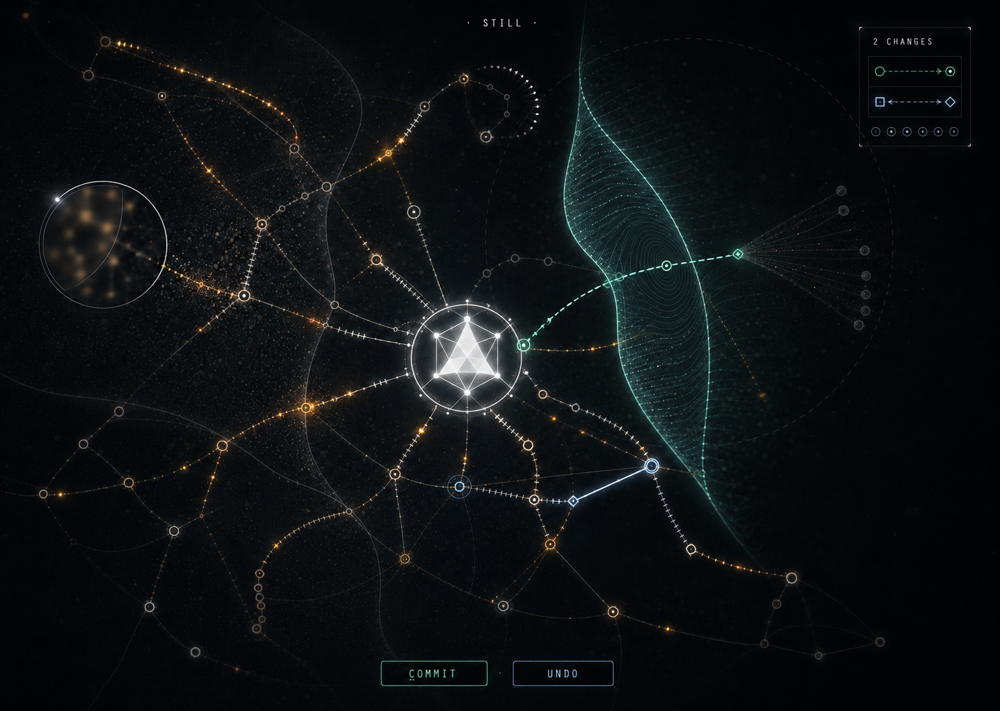

### Reality of play

The simulation pauses. The player spatially proposes causal construction
changes. The world does not change until Commit. Undo removes the newest
proposal.

### Implementation pseudocode

```ts
function StillMode() {
  selected = useFieldSelection()
  draftGesture = useConstructionGesture(selected)

  if (draftGesture.completed) {
    worker.send('queue_plan', translateGesture(draftGesture))
  }

  renderProposals(queue.entries, {
    validColor: 'mint',
    invalidColor: 'red',
    physicalEdgeColor: 'grey',
  })

  renderQueueTray({
    entries: queue.entries,
    interventionCost: queue.cost_total,
    budgetAfter: queue.impulse_after,
    predictedReadings: queue.preview,
  })

  CommitButton.onClick = () => worker.send('commit_plan', {})
  UndoButton.onClick = () => worker.send('undo_plan', {})
}
```

### Required correction

Remove passive candidate focus/View changes from the paid plan queue. Only
Routes and physical-compartment edits spend Intervention Budget.

The current tray's visible Commit and Undo must become pointer-operable controls
using the same commands as keyboard activation.

---

## 9. Measurement Grain

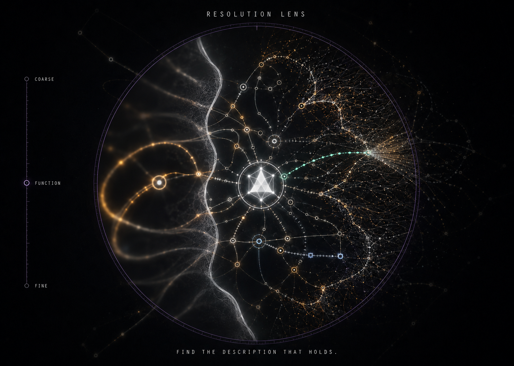

### Reality of play

This is not zoom. The player asks how much recorded causal-state detail can be
grouped without losing agreement with a named functional trace. The game does
not call this prediction unless a predictor is fitted and evaluated out of
sample.

Concrete task:

> With subsystem `I`, 45-step window `w`, and comparison set `S` fixed, select
> the coarsest declared partition whose outlet-flow trace has normalized
> absolute-error agreement of at least `0.90` with the Component-level trace on
> the held-out interval.

```text
agreement(C)
= clamp(1 - sum_k |y_C(k) - y_ref(k)|
          / max(epsilon, sum_k |y_ref(k)|), 0, 1)
```

The experiment freezes the nested partitions, aggregation rule, target trace,
fitting interval, held-out interval, and nonzero `epsilon` guard before
evaluation.

### Implementation pseudocode

```ts
const GRAINS: NestedPartition[] = loadDeclaredNestedPartitions()

function MeasurementGrainLens() {
  grain = useSliderSelection(GRAINS)
  assertFineToCoarseSurjection(GRAINS)
  view = { ...activeView, coarseGraining: grain }

  result = await worker.send('inspect_view', {
    view,
    instrument: 'resolution_consistency',
    target: declaredOutput,
  })

  renderer.setInstrumentOverlay({
    kind: 'measurement_grain',
    aperture: view.region,
    groups: result.groups,
    retainedAgreement: result.agreement,
  })
}
```

The frame state remains unchanged. Grouping occurs over recorded history. Each
grain is an explicit partition with a fine-to-coarse surjection to the next;
numeric labels such as `2`, `4`, and `8` do not establish that lattice by
themselves. Entropy or support comparisons, if ever enabled, may vary `C` only
while holding `I`, `w`, and `S` fixed.

---

## 10. Disturbance grammar

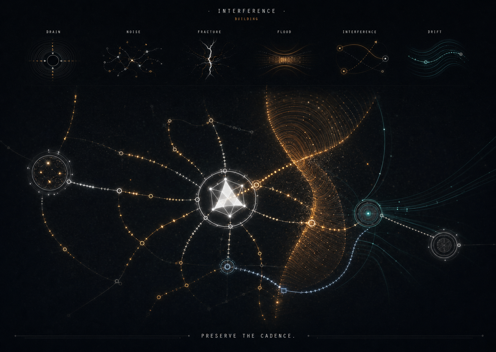

### Reality of play

A disturbance is an environmental process with a target, level, stage, onset,
and explicit modified variable. The top rail is a glossary; the main Field
shows the active event.

### Literal mappings

| Existing machine name | Player label | Exact current effect |
|---|---|---|
| Drain | Dissipation Increase | Raises per-Component resource loss on a layer |
| Noise | Conductance Variability | Randomly narrows Route transfer on a layer |
| Fracture | Route Failure | Removes a target Route at crisis |
| Flood | Operating-limit Compression | Lowers the target's overload threshold |
| Interference | Supply Diversion | Gives a target first claim on part of same-layer Supply |
| Drift | Supply-path Displacement | Moves Supply Stream paths on a layer |

### Implementation pseudocode

```ts
function renderDisturbance(scene, pressure, frameHistory) {
  switch (pressure.kind) {
    case 'drain': renderDissipationLoss(scene, pressure.targetLayer); break
    case 'noise': renderRouteConductanceVariance(scene, pressure.targetLayer); break
    case 'fracture': renderRouteStress(scene, pressure.targetRoute); break
    case 'flood': renderContractingOperatingLimit(scene, pressure.targetNode); break
    case 'interference': renderSupplyDiversionPath(scene, pressure.targetNode); break
    case 'drift': renderSupplyPathWithGhost(scene, frameHistory); break
  }
  renderStageLabel(pressure.stage, pressure.level, pressure.onset)
}
```

Existing `FramePressure` data and cues support the first render pass; no new
physics is required for literal relabeling.

---

## 11. Divergence Replay

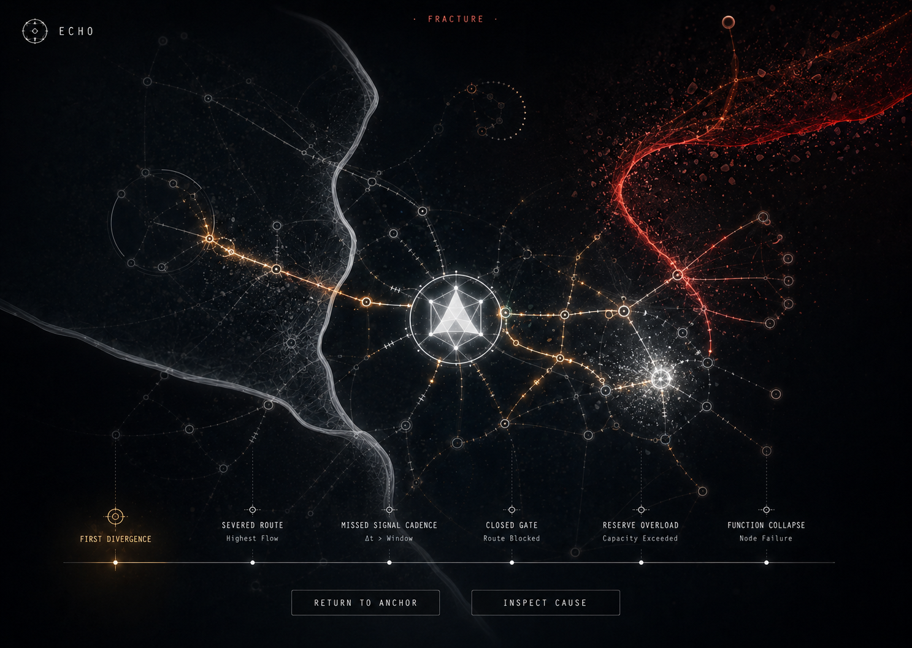

### Reality of play

The player scrubs a baseline and one altered run from the same Anchor. The
intervention is the only declared difference. The system locates the earliest
recorded difference above tolerance, then shows downstream threshold crossings.

It does not label the first divergence as the complete cause.

### Result contract

```ts
interface DivergenceResult {
  baselineTrial: TrialId
  alteredTrial: TrialId
  intervention: InterventionDraft
  firstDivergence: {
    step: number
    target: ComponentId | RouteId | null
    metric: MetricId
    baseline: number
    altered: number
    tolerance: number
    unit: UnitId
  }
  links: Array<{
    step: number
    kind: 'route_change' | 'flow_deficit' | 'input_miss' |
          'gate_change' | 'operating_limit' | 'function_failure'
    target: number | null
    observed: number
    threshold: number
    unit: UnitId
  }>
}
```

### Implementation pseudocode

```rust
fn divergence_replay(anchor, intervention, tolerance_set) -> DivergenceResult {
    random = KeyedCommonRandomness::new(anchor.noise_key);
    // Draw address = (event_kind, object_id, step), never global draw order.
    baseline = replay(anchor, no_intervention, random, same_open_loop_control);
    altered = replay(anchor, intervention, random, same_open_loop_control);

    first = first_metric_difference(baseline, altered, tolerance_set);
    links = collect_declared_threshold_crossings_after(first.step);
    return DivergenceResult { first, links, ... };
}
```

```ts
timeline.onScrub(step => renderer.setPairedPlayback(baseline, altered, step))
returnToAnchor.onClick(() => worker.send('restore_checkpoint', { anchor_id }))
inspectTarget.onClick(id => pinTrace(id))
```

---

## 12. Ensemble Overlay

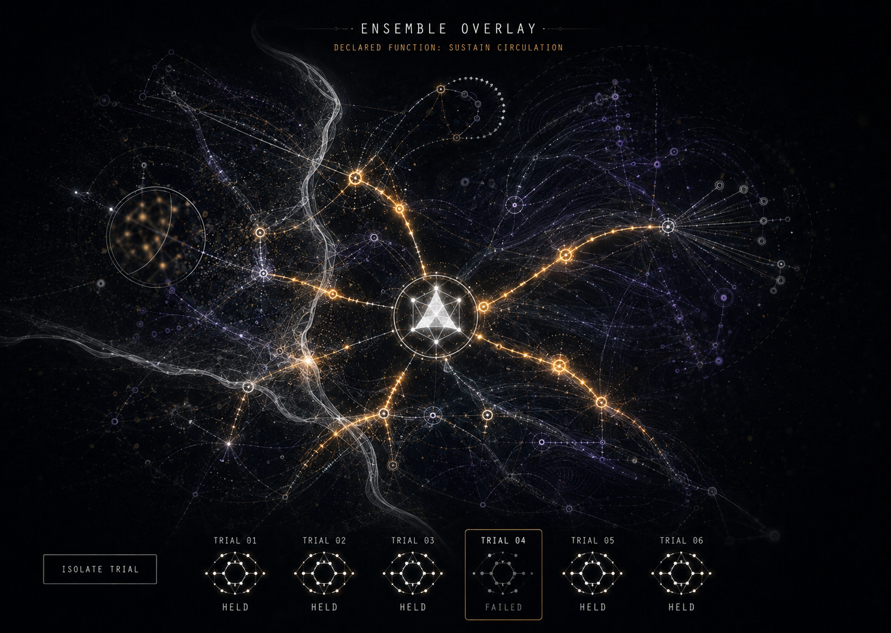

### Reality of play

The same complete `ScenarioSpec` is run under modeled runtime-noise realizations
or samples from one declared initial-state distribution. A neutral/open-loop
control sequence is held identical; an internal frozen feedback policy belongs
to `GeneratorSpec` and may act differently when states differ. The player sees
observed variation without confusing it with a changed design.

### Compact result

```ts
interface TrialSummary {
  trialId: TrialId
  rngAlgorithm: string
  reproducibilityStateKey: string
  passed: boolean
  failureMode: FailureMode | null
  failureStep: number | null
  metricSeries: CompressedSeries[]
  ghostPath: CompressedPath
}

interface EnsembleSummary {
  trials: TrialSummary[]
  passCount: number
  trialCount: number
  median: CompressedSeries[]
  observedRange: RangeSeries[]
  failureCounts: Record<FailureMode, number>
  view: ViewDeclaration
  observedDistinctOutcomeCount: number
}
```

### Implementation pseudocode

```text
Start Ensemble job
  -> freeze and hash the complete ScenarioSpec
  -> sample modeled noise streams under a declared PRNG algorithm
  -> run trials in analysis worker or cooperative chunks
  -> emit progress only
  -> transfer one compact summary
  -> load complete replay only when player chooses Isolate Trial
```

```ts
onTrialClick(trialId => {
  selectedTrial = trialId
  renderer.setEnsembleGhosts(summary.trials)
  worker.send('load_trial_replay', { trial_id: trialId })
})
```

An eight-trial minimum-to-maximum band is labelled `Observed range`, never a
confidence interval. The job reports no Shannon entropy, Hartley support,
support cost, or channel capacity. A PRNG seed/state indexes a modeled
realization; it does not measure the random bits consumed, and a reproduction
state supplied for exact replay is side information.

---

## 13. Holdout Validation dashboard

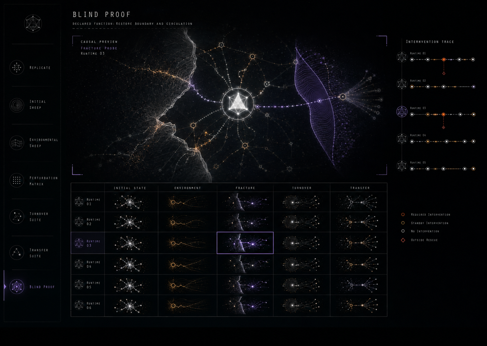

### Reality of play

The player freezes a generator and preregisters a vector of pass criteria.
Editing and rescue lock before the hidden condition schedule is revealed. Each
result entry can be selected to inspect its recorded causal trace without
revealing the sealed schedule.

### Job matrix

```ts
interface HoldoutPlan {
  generatorHash: string
  regimeSetHash: string
  criteria: FunctionCriterion[]
  controlPolicy: 'neutral_open_loop' | 'internal_frozen_feedback'
  hiddenSuiteId: string
  hiddenSuiteVersionHash: string
  sealedBeforeCandidateHash: string
  contaminationStatus: 'clean' | 'retired' | 'contaminated'
}

interface HoldoutEntry {
  jobId: string
  initialConditionId: string
  environmentId: string
  interventionId: string
  passed: boolean
  reasons: CriterionResult[]
  evidenceHash: string
}
```

### Implementation pseudocode

```text
Preregister criteria
  -> verify suite was independently selected, sealed, and version-hashed
  -> hash frozen ScenarioSpec and visible plan
  -> lock causal editing and direct rescue
  -> reveal held-out job identifiers
  -> execute job matrix
  -> store criterion vector, never one collapsed science value
  -> select one entry for replay and causal preview
```

```ts
BeginHoldoutButton.onClick = async () => {
  plan = await freezeAndHashCurrentDesign()
  job = await worker.send('start_analysis_job', { kind: 'holdout', plan })
  routeTo('holdout-results', job.id)
}
```

The player-facing technical name is `Holdout Validation`; an atmospheric
subtitle may remain.

After repeated optimization against a revealed suite, that suite is retired or
marked contaminated and cannot support a fresh Holdout claim. Human/adaptive
external control is not represented by an action hash; admitting it would
require accounting for its sensing, memory, communication, and actuation
channel.

The local implementation seals a randomized suite identity, candidate hash,
and suite-version hash before passing the suite seed into the authoritative Rust
trial family. IndexedDB preserves contamination and retirement state; this is
local preregistration, not independent server custody. The Holdout table opens
each selected condition as a recorded throughput preview with outcome and
failure evidence; it does not synthesize or expose the hidden condition inputs.
Once sealed, the laboratory fades ordinary header and navigation chrome,
surfaces the frozen suite-version seal, and leaves no rescue control inside the
Holdout workspace.

---

## 14. Atmospheric Holdout plate

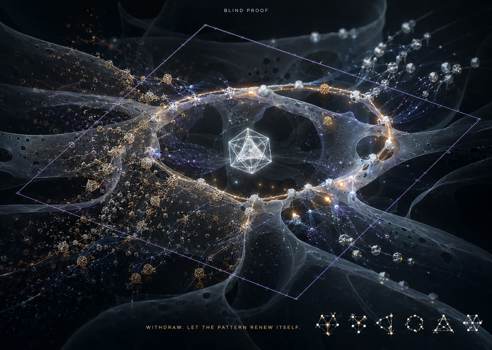

This is not a separate screen. It is an art-direction reference for the moment
direct control is withdrawn.

```text
Holdout transition
  -> fade ordinary chrome
  -> show frozen-control seal
  -> keep Form and causal network live
  -> display no clickable rescue controls
  -> animate only selected trial
```

Use the organic cavity, white Form, amber internal paths, and violet
noncausal frame as visual motifs. Do not attempt to simulate the dense material
as thousands of independent physics objects.

---

## 15. Autonomous Renewal

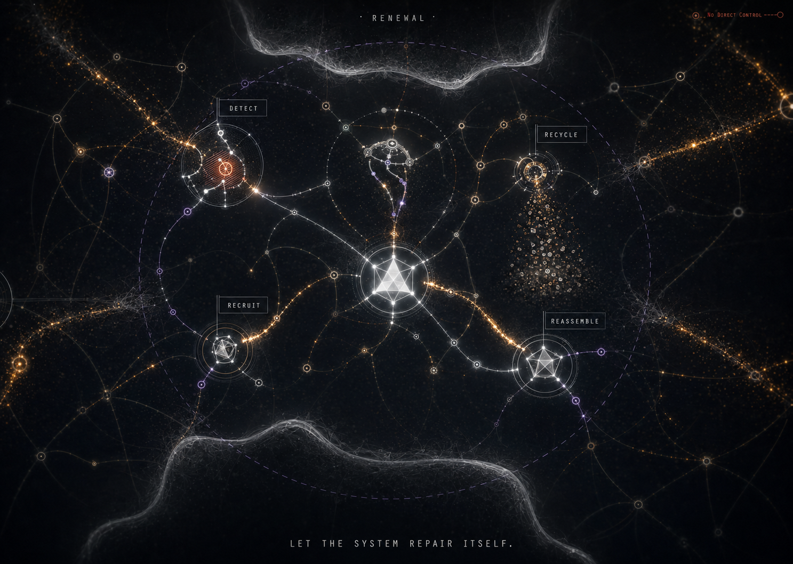

### Reality of play

The player designs local detection, recycling, recruitment, positioning, and
reconnection rules before the trial. A Component is then degraded, direct
control locks, and the system must restore the declared function on its own.

The current automatic external substitution is not this mechanic.

### Local causal contract

```rust
struct LocalPolicyInput<'a> {
    self_state: &'a ComponentState,
    neighbor_routes: &'a [NeighborRouteState],
    local_material: &'a [LocalMaterialState],
    decoded_signals: &'a [DecodedLocalSignal],
    timers: &'a [LocalTimer],
}

struct RenewalAssayRecord {
    // Evaluation data is private to the experimental harness.
    withheld_failed_target: ComponentId,
    detected_step: Option<Step>,
    observed_replacement: Option<ComponentId>,
    observed_rebuilt_routes: Vec<RouteId>,
    spent_q: Fx,
    spent_material: MaterialAmount,
}
```

### Implementation pseudocode

```rust
fn advance_local_policy(component_id, world) {
    input = gather_local_policy_input(component_id, world);
    actions = frozen_policy_for(component_id).step(input);
    apply_local_actions(component_id, actions, world);
}
```

No route endpoint, position, open state, or View membership is inherited
automatically. The UI exposes latency, material and resource cost, reconnection
fraction, recovery time, and ensemble pass rate.

The assay harness may know the removed target for evaluation but never exposes its
identifier, target position, source pool, or desired topology to a repair
policy. Detect/Recruit/Position/Reconnect labels are retrospective observational
annotations, not a global controller.

---

## 16. Batch Inheritance Assay

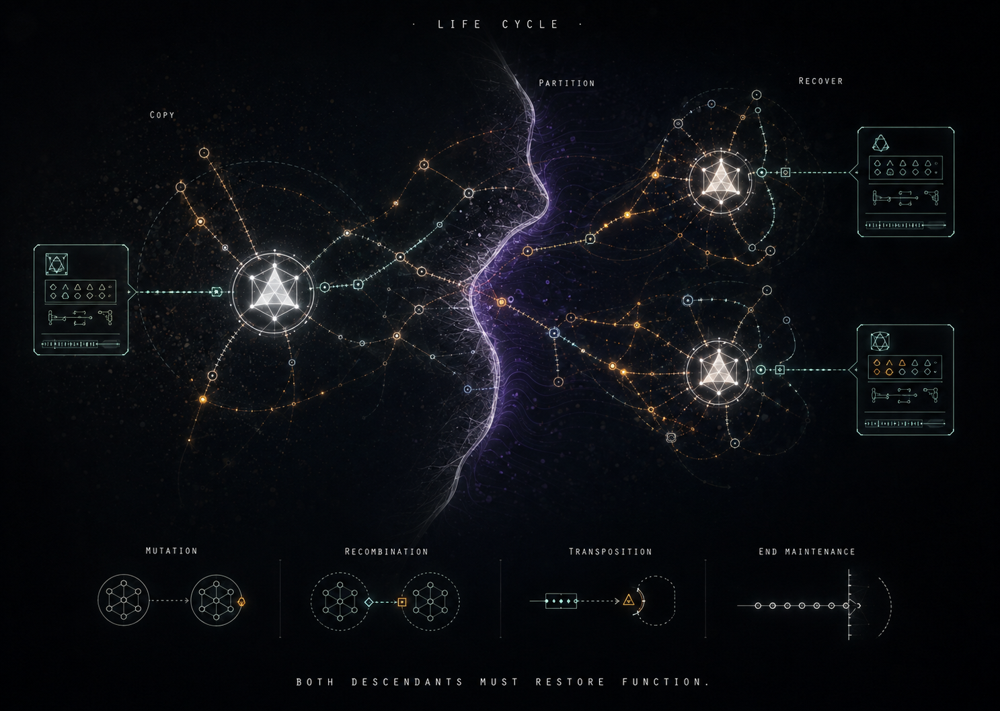

### Reality of play

The experimental harness externally copies a declared specification and
partitions state, then measures recovery in two resulting trials. This is a
Batch Inheritance Assay, not evidence of autonomous reproduction.

### First safe architecture

Use cloned batch states rather than two simultaneous hot-loop worlds.

```rust
struct BatchInheritancePlan {
    copy_policy: CopyPolicy,
    partition_policy: PartitionPolicy,
    criterion: FunctionCriterion,
}

fn run_batch_inheritance_assay(parent, plan, seeds) -> BatchInheritanceResult {
    copied = harness_copy_generator_spec(parent, plan.copy_policy);
    (child_a, child_b) = harness_partition_state(copied, plan.partition_policy);
    run_hands_off_recovery(&mut child_a, plan.criterion);
    run_hands_off_recovery(&mut child_b, plan.criterion);
    summarize_inheritance_and_function(child_a, child_b)
}
```

### UI

```text
left source state
  -> external copy and partition event
  -> upper and lower resulting-trial cards
  -> future operator rail remains disabled
  -> exact inherited and changed objects on hover
```

Mutation, recombination, transposition, and end maintenance remain unavailable
until a concrete heritable representation, operator semantics, and causal
copying mechanism exist. Linked Chorus Forms are not descendants and cannot
substitute for this assay.

The implemented assay copies the immutable specification hash, partitions
embodied Component/material/Route state externally, runs both children through
ordinary hands-off Rust transitions, and returns exact inherited Component and
Route identity sets with recovery evidence.

---

## 17. Crowded Medium

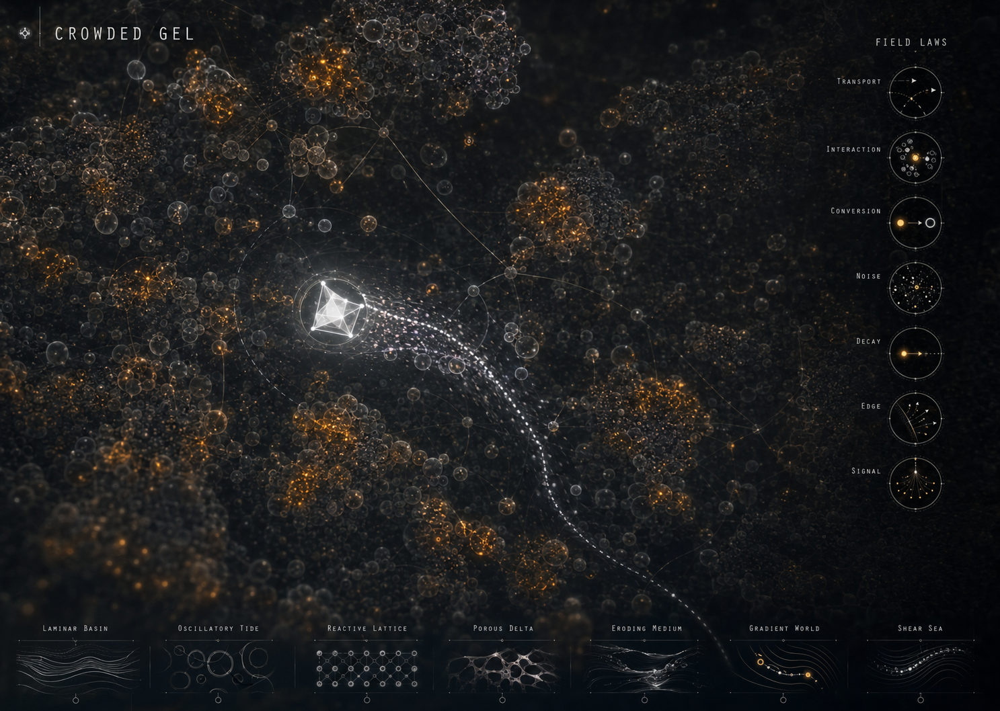

### Reality of play

This is one Atlas Field regime, not a menu for changing seven physical laws in
the middle of a trial. The Form moves through a crowded environment with stated
transport, capture, dissipation, and permeability rules.

The current core only owns layer dissipation, transport variability, gain,
Supply geometry, Routes, and scheduled disturbances. Conversion, interaction,
and signaling cannot appear as live law controls until they have causal models.

### Honest first preset

```ts
interface RegimePresetV1 {
  layers: Array<{ dissipation: Fx; conductanceNoise: Frac; supplyGain: Frac }>
  supplies: SupplyStreamDraft[]
  routeCapacityScale: Frac
  compartmentMaterial: CompartmentMaterialId
  disturbanceSchedule: DisturbanceDraft[]
  visualPreset: 'laminar' | 'crowded' | 'porous' | 'gradient' | 'shear'
}
```

### Render pseudocode

```ts
function renderCrowdedMedium(scene, quality) {
  scene.staticBackdrop.texture = cachedCrowdedGelTexture
  scene.mediumVisuals.setInstancedParticles({
    count: quality === 'high' ? 320 : quality === 'medium' ? 180 : 80,
    parallaxOnly: true,
  })
  // Gel particles are not core Components and carry no causal state.
}
```

If crowding later changes motion, add an explicit local drag/diffusion field
sampled by the core. The visual density must not secretly stand in for physics.

---

## 18. Vestige pressure plate

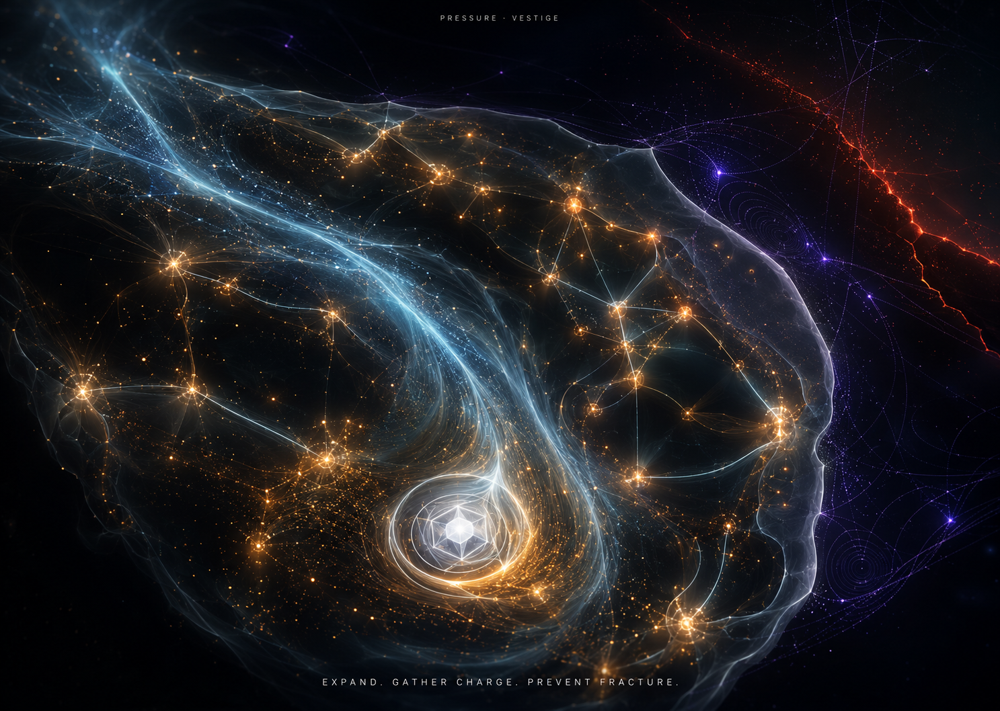

This is not a separate UI. It is an art plate for a late-stage disturbance in
which a network is forced into a confined resource and stress geometry.

```text
disturbance reaches crisis
  -> load cached pressure texture for the local region
  -> tint affected Routes and compartment segments from actual targets
  -> preserve selectable Components and literal HUD readings
  -> never hide the exact failure criterion under the cinematic layer
```

The instruction “gather Charge, expand, prevent fracture” is retired unless an
objective states quantities, duration, and permitted controls.

---

## 19. Open Field, refined

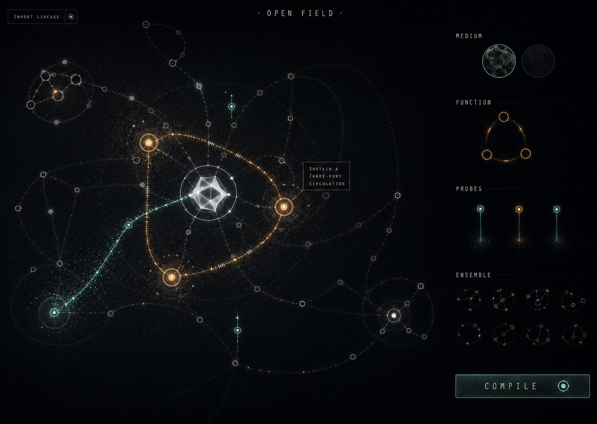

### Reality of play

Open Field is a constrained scenario authoring surface. The player places
Components and Routes, chooses an implemented Field regime and addressed input
schedule, defines a measurable function, and freezes the design for trial runs.

`Compile` means validate, canonicalize, hash, and instantiate existing systems.
It does not imply arbitrary source-code or differential-equation compilation.

### Draft contract

```ts
interface ScenarioDraft {
  phi: { lawsetId: FixedLawsetId; substrateParameters: SubstrateParameters }
  generatorSpec: {
    formId: FormId
    componentKinds: ComponentKindDraft[]
    topologyConstraints: TopologyConstraintDraft[]
    localPolicy: FrozenLocalPolicyDraft
    addressedInputs: AddressedInputDraft[]
  }
  initialState: {
    distribution: InitialStateDistributionDraft
    exactPlacementsAsSideInformation: ComponentPlacement[]
    exactRoutesAsSideInformation: RoutePlacement[]
    compartmentMembers: ComponentId[]
    material: MaterialDraft[]
  }
  exogenousInputs: PhysicalInputScheduleDraft[]
  controlContract: ControlContractDraft
  analysisProtocols: ViewDeclaration[]
  criterion: FunctionCriterion
  interventionPlan: InterventionPlanDraft
  trialPlan: TrialPlan
}
```

### Implementation pseudocode

```ts
function OpenFieldEditor() {
  draft = useScenarioDraft()
  gesture = useFieldAuthoringGesture()
  draft = reduceDraft(draft, gesture)

  validation = await worker.send('validate_scenario', { draft })
  renderValidationMarks(validation)

  CompileButton.onClick = async () => {
    if (!validation.valid) return focusFirstFault(validation)
    compiled = await worker.send('compile_scenario', { draft })
    routeTo('ensemble', compiled.experimentId)
  }
}
```

```rust
fn compile_scenario(draft) -> CompiledExperiment {
    validated = validate_against_fixed_lawset(draft)?;
    canonical = canonicalize(validated);
    hash = sha256(canonical.bytes());
    return instantiate_experiment(canonical, hash);
}
```

The first implementation should emit the existing discrete content model. It
must not offer unsupported conversion, reaction, or arbitrary `6.2 Hz`
oscillators.

The implemented compiler offers all four versioned discrete-transport lawsets,
explicit Component position, kind, Charge, capacity, upkeep, and open state,
Directed Routes with capacity scaling, physical membership, placed typed
material, Supply position and width, a power-of-two observation protocol, a
hands-off trial family, and one constrained `Blade`, `Clamp`, or `Breach` plan.
Rust validates, canonicalizes, hashes, instantiates, and executes that draft;
the React editor does not maintain a second trial model.

---

## 20. Open Field, equation-heavy study

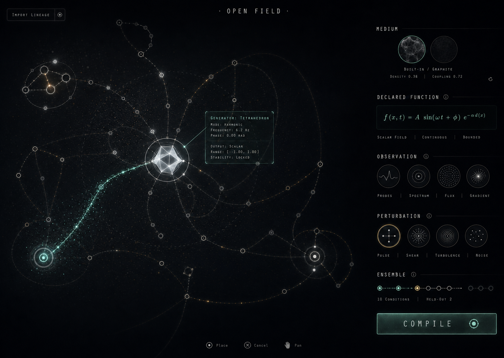

This screen is superseded by the refined Open Field. Retain its useful
right-hand grouping—Field, declared function, observation, intervention, and
trial plan—but retire the arbitrary scalar equation and decorative frequency,
phase, spectrum, and stability values.

```text
reuse layout groups
  -> bind each group to ScenarioDraft fields
  -> show only lawset-supported editors
  -> validate every numeric value and unit
  -> hide unavailable categories
```

At `30 steps/s`, periodic Supply uses an integer step period and an integer
on-window `ceil(period × duty)`. The Atlas states both the duty and compensated
on-window delivery rather than printing a frequency the scheduler cannot
represent.

---

## 21. Archive

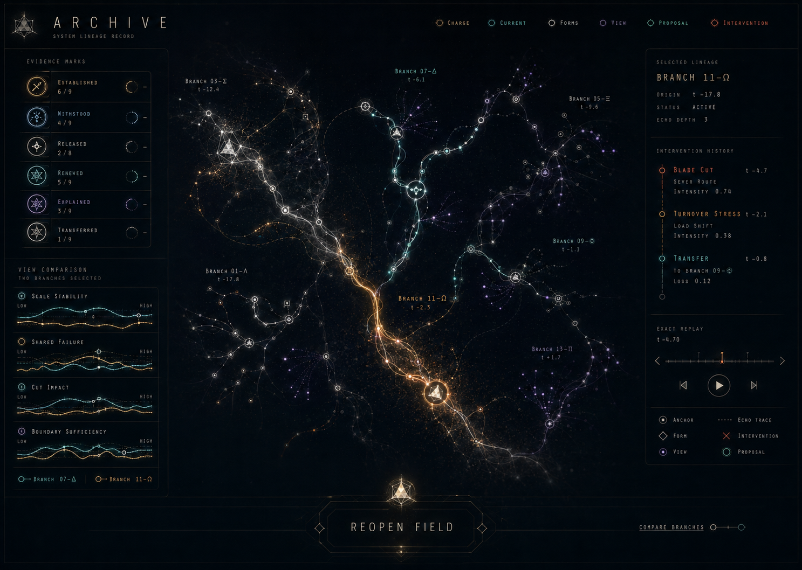

### Reality of play

The Archive is a spatial history of generators, branches, interventions,
ensembles, holdouts, transfers, and failures. Browsing changes nothing.
Reopening a record creates a new branch and preserves the original.

### Durable data model

```ts
interface ArchiveRunRecord {
  schemaVersion: number
  engineBuildHash: string
  lawsetVersion: string
  protocolVersion: number
  contentHash: string
  runId: string
  branchNonce: number
  parent: { runId: string; branchNonce: number; anchorId: number } | null
  generatorHash: string
  regimeId: RegimeId
  lawsetId: LawsetId
  inputHash: string
  controlHash: string
  rngAlgorithm: string
  reproducibilityStateKey: string
  estimatorVersion: string | null
  analysisProtocolHash: string
  trialCount: number
  criterionVector: FunctionCriterion[]
  payloadBlobKey: string
  evidence: EvidenceRecord[]
  createdAt: number
}

interface EvidenceRecord {
  kind: 'established' | 'withstood' | 'renewed' |
        'paired_effect_observed' | 'transferred'
  experimentHash: string
  criteria: CriterionResult[]
  artifactKeys: string[]
}
```

### Implementation pseudocode

```text
checkpoint_written or autosave
  -> export canonical payload
  -> store payload Blob in IndexedDB
  -> store run/branch metadata
  -> store analysis artifacts separately
  -> update spatial lineage index
```

```ts
function ArchiveScreen() {
  graph = await archiveDb.loadLineageGraph()
  selected = useGraphSelection(graph)
  comparisons = await archiveDb.compare(selected.branches)

  renderSpatialLineage(graph, selected)
  renderEvidenceVector(selected.record.evidence)

  ReopenButton.onClick = () => client.recoverBranch({
    anchorId: selected.anchorId,
    parentBranch: selected.branch,
  })
}
```

Existing export/import, anchors, branch nonce, and exact payloads remain the
core primitives. The rapid implementation pass now stores canonical exports
and evidence in IndexedDB, projects selectable run lineages, and reopens a
selected durable record through a loaded-state branch command that preserves
the archived source.

---

## Screen routing and ownership

```ts
type ShellRoute =
  | { screen: 'atlas' }
  | { screen: 'form-select'; regimeId: RegimeId }
  | { screen: 'field'; runId: string }
  | { screen: 'observe'; runId: string }
  | { screen: 'intervene'; runId: string; anchorId: number }
  | { screen: 'divergence'; experimentId: string }
  | { screen: 'ensemble'; experimentId: string }
  | { screen: 'holdout'; experimentId: string }
  | { screen: 'renewal'; experimentId: string }
  | { screen: 'inheritance-assay'; generatorId: string }
  | { screen: 'open-field'; draftId: string }
  | { screen: 'archive' }
```

| Surface | Owner |
|---|---|
| Atlas, selection, forms, laboratory panels, grids, Archive | React shell |
| Live Field, forms, Components, Routes, Supply, compartments, cues | Pixi/Canvas renderer from compact frame |
| Authoritative causal state and deterministic transition | Rust core |
| Fixed-step schedule, analysis-job coordination, transferables | Worker |
| Passive instrument calculations and counterfactual replays | Rust analysis path, invoked on demand |
| Durable records and metadata | Shell IndexedDB |

The implemented cold path transfers a canonical export to a dedicated module
worker, imports it into Rust/WASM, restores one cloned `RunState` per addressed
trial, and advances the ordinary transition. The Observe path is a separate
non-mutating Rust command over the loaded Field and selected View; the React
shell only renders returned readings.

## Implementation sequence implied by the mock-ups

1. Restore reproducible Rust/WASM generation.
2. Split physical compartment from passive View across Rust state, save
   migration, frame bits, worker types, renderer layers, and Still Mode.
3. Separate immutable `GeneratorSpec` from embodied state and encode or
   disclose exact initial organization.
4. Correct Supply capture geometry and implement the versioned simultaneous
   transport allocator.
5. Introduce render quality tiers, cap effective device-pixel ratio, and keep
   Number 2 environmental art cached.
6. Generate measurable Form and Regime catalogs from authored content.
7. Implement the Atlas → Form → Active Commissioning → Still/View vertical slice.
8. Implement real Vault, locally sensed Lens, Knot, Wake, and Chorus abilities or mark the
   corresponding Forms pending.
9. Build the passive Observe Bench and Measurement Grain instrument.
10. Expose only supported typed interventions, then add missing interventions
   one causal model at a time.
11. Build paired Divergence Replay with keyed common randomness.
12. Add IndexedDB archive storage and background analysis-job infrastructure.
13. Build descriptive Ensemble Overlay and sealed Holdout Validation.
14. Add additional Field regimes with one explicit physical law at a time.
15. Add typed material, local detection/recruitment/reconnection, and genuine
   Autonomous Renewal.
16. Build the external Batch Inheritance Assay; reserve Life Cycle claims until
    causal copying and a heritable representation exist.
17. Build the constrained Open Field compiler and complete the Archive graph.

## Performance gates

- Atlas and large environment material: compressed cached texture.
- Effective device-pixel ratio: cap at `1.5–2.0` by quality tier.
- Active Field moving visual particles: remain inside the existing bounded
  pool; target roughly `180–320` in high quality.
- No full-screen fluid solver.
- No more than four full-screen compositing passes.
- Stop Atlas animation while idle or hidden.
- Use instanced or pooled decorative gel sprites; never core Components.
- Remove per-Component Canvas2D radial gradients at low quality.
- Keep Ensemble and Holdout results outside the hot 32 KiB frame.
- Load one selected replay on demand rather than all trial frames.
- Run long analysis in a second worker or cooperative chunks so synchronous
  WASM analysis does not freeze the live simulation worker.
